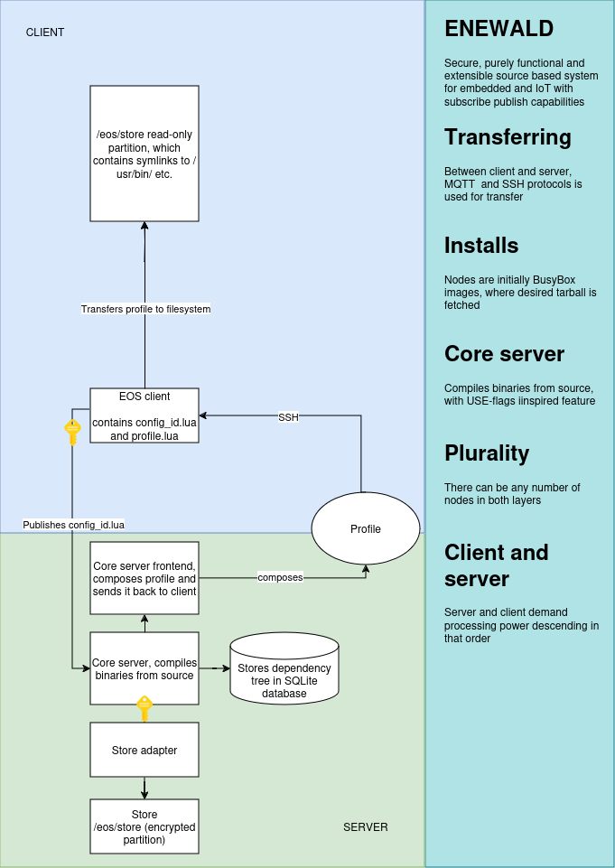

# Initial research plan 

## Background

My thesis, "NixOS as a declarative and synchronised
solution to embedded security challenges
and system administration problems for
multiple embedded devices", uses Nix a standpoint for a secure solution for updating and keeping multiple embedded devices secure. However, multiple issues proved that Nix – while being a respectable Linux distribution for desktop and server usage alike, isn't the adequate tool for embedded. These issues are as follows:

1. Lack of support for other processor architectures other than amd64 and arm64 
2. Lack of USE-flag system (relates to customisation of source-build binaries)
3. Marriage with SystemD. NixOS doesn't provide any kind of support to other init systems
4. Lack of proper support to other kernels than Linux
5. Difficult and gruesome configuration language syntax
6. Cluttered environment with unopinionated solutions, such as Home Manager and Flakes
7. Opinionated directory structure, which causes inoperability with some programs
8. Searched solution for embedded in general proved to be out-of-scope.

To overcome these problems, I'm developing a new Linux distribution, Enewald, that overrides the corresponding problems with:

1. The system is based on Linux images generated with Buildroot with Lua language and BusyBox as its only dependency – providing support for any imaginable system that suppports mentioned dependencies.
2. The Enewald core handles all dependency issues, composing a profile for each needed configuration with a USE-flag system and patching support.
3. The Enewald system is init system-agnostic, with main support for OpenRC. A purely functional init system would be a research topic for another study.
4. While the system defines the used kernel, support for other kernels is trivial.
5. Lua syntax has very easy learning curve, and purely functional paradigm uses a subset of the language. State is never used in the system configurations.
6. Single opinionated way to configure, adhering to Enewald specification/standard
7. Package configuration the ability to define mutable elements, which operates as a layer for "legacy".
8. Enewald is not intended to see usage as a desktop distribution, although it is a project goal; working desktop is a benchmark for stable system. Instead the distributiontargets primarily embedded device server/node architectures.

## Enewald in a nutshell

## Research 

Main research topics:

- How does the proposed system compare with existing solutions, both imperative and declarative from a security perspective (POMDP?).
- How kernel, init system agnostic can a system be?
- How can the hardware side of such system be hardened as much as possible?
- Is publish/subscribe model adequate for a whole Linux distribution from end-user standpoints
- How could a package configuration made to be understood to a regular user? What UI/UX solutions would be most appropriate for such complex system.
- USE flags dependency handling in conjunction with purely functional package manager

## Bibliography

[1] E. Dolstra and A. Löh, “Nixos: A purely functional linux distribution”, in Pro-
ceedings of the 13th ACM SIGPLAN international conference on Functional
programming, 2008, pp. 367–378.

[2] S. van der Burg, A Reference Architecture for Distributed Software Deploy-
ment. Citeseer, 2013.

[3] G. K. Thiruvathukal, “Gentoo linux: The next generation of linux”, Computing
in science & engineering, vol. 6, no. 5, pp. 66–74, 2004.

[4] J. Dieguez Castro and J. Dieguez Castro, “Nixos”, Introducing Linux Distros,
pp. 301–327, 2016.

[5] Canonical, Ubuntu Manpage: Apt - command-line interface — manpages.ubuntu.com,
https://manpages.ubuntu.com/manpages/bionic/man8/apt.8.html, [Ac-

cessed 22-05-2024].
[6] L. Wang, S. Jajodia, and A. Singhal, Network security metrics. Springer, 2017.

[7] NixOS Manual — nixos.org, https://nixos.org/manual/nixos/stable/,

[Accessed 22-05-2024].
[8] E. Dolstra, R. Vermaas, and S. Levy, “Charon: Declarative provisioning and
deployment”, in 2013 1st International Workshop on Release Engineering (RE-
LENG), IEEE, 2013, pp. 17–20.
REFERENCES 45

[9] E. Dolstra, A. Löh, and N. Pierron, “Nixos: A purely functional linux distri-
bution”, Journal of Functional Programming, vol. 20, no. 5-6, pp. 577–615,
2010.

[10] Home Manager Manual — nix-community.github.io, https://nix-community.
github.io/home-manager/, [Accessed 24-05-2024].

[11] Flakes - NixOS Wiki — nixos.wiki, https : / / nixos . wiki / wiki / Flakes,
[Accessed 22-05-2024].
[12] Nix channels - NixOS Wiki — nixos.wiki, https://nixos.wiki/wiki/Nix_
channels, [Accessed 22-05-2024].

[13] K. Fysarakis, G. Hatzivasilis, K. Rantos, A. Papanikolaou, and C. Manifavas,
“Embedded systems security challenges”, in Measurable security for Embedded
Computing and Communication Systems, SCITEPRESS, vol. 2, 2014, pp. 255–
266.

[14] History of SSH | SecOps® Solution — secopsolution.com, https : / / www .
secopsolution.com/blog/history-of-ssh, [Accessed 18-03-2024].

[15] N. Turab and Q. Kharma, “Secure medical internet of things framework based
on parkerian hexad model”, International Journal of Advanced Computer Sci-
ence and Applications, vol. 10, no. 6, 2019.

[16] R. A. Kemmerer, “Cybersecurity”, in 25th International Conference on Soft-
ware Engineering, 2003. Proceedings., IEEE, 2003, pp. 705–715.

[17] MQTT Version 3.1.1 — docs.oasis-open.org, http : / / docs . oasis - open .
org/mqtt/mqtt/v3.1.1/os/mqtt-v3.1.1-os.html, [Accessed 22-05-2024].

[18] G. Pender-Bey, “The parkerian hexad”, Information Security Program at Lewis
University, 2019.
REFERENCES 46

[19] J. Hughes and G. Cybenko, “Quantitative metrics and risk assessment: The
three tenets model of cybersecurity”, Technology Innovation Management Re-
view, vol. 3, no. 8, 2013.

[20] Security - NixOS Wiki — nixos.wiki, https://nixos.wiki/wiki/Security,
[Accessed 22-05-2024].
[21] Y. V. Papazov, “Cybersecurity metrics”, NATO Science and Technology Or-
ganization (STO), pp. 1–18, 2019.

[22] J. C. M. Ashely S. M McAbee Murali Tummala, The use of partially ob-
servable Markov decision processes to optimally implement moving target de-
fense, https : / / scholarspace . manoa . hawaii . edu / server / api / core /
bitstreams/86f32196-380c-443a-88b5-07f07649137e/content, [Accessed
23-05-2024].

[23] L. Carin, G. Cybenko, and J. Hughes, “Cybersecurity strategies: The queries
methodology”, Computer, vol. 41, no. 8, pp. 20–26, 2008.

[24] L. Courtès, “Functional package management with guix”, arXiv preprint arXiv:1305.
